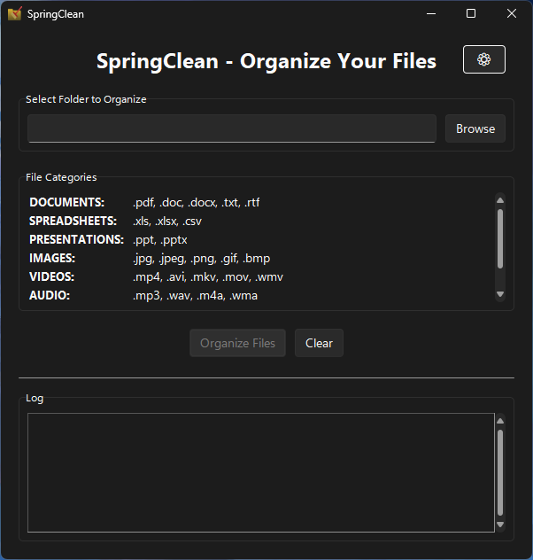

# SpringClean: Organize your messy folder with ease!

A new best friend for your messy Downloads folder! (or literally any other folder)

## Features

* **Beautiful user interface** based on Windows 11 Fluent Design
* **Customizable themes**: Auto (follows system), Light, or Dark theme
* **Progress tracking**: Real-time progress bar showing organization status
* *(NEW)* **Customizable file categories**: Load your own category definitions via JSON files
* **Multi-threaded processing**: Smooth UI that doesn't freeze during organization
* **Comprehensive logging**: Detailed log of all file operations

## Available Category Presets

The application includes three preset category configurations:

1. **Basic** (`categories_basic.json`) - Default configuration

   - 8 essential categories covering common file types
   - Perfect for typical home users and basic office work
2. **Intermediate** (`categories_intermediate.json`) - Extended file support

   - 20 categories including creative and development files
   - Great for content creators, students, and casual developers
3. **Advanced** (`categories_advanced.json`) - Comprehensive professional support

   - 30+ specialized categories for power users
   - Ideal for developers, designers, and technical professionals

Or make your own JSON config file and load it on the settings page.

## Installation

**Currently only Windows systems are supported**

* On the [Releases](https://github.com/nathanaeru/SpringClean/releases) page, download the SpringClean.zip file.
* Extract to your desired folder.
* Run the SpringClean.exe file and now you're good to go!

## Built with

* [Python](https://www.python.org/)
* [darkdetect](https://pypi.org/project/darkdetect/)
* [sv-ttk](https://pypi.org/project/sv-ttk/)
* [pywinstyles](https://pypi.org/project/pywinstyles/)
* This is my first real-world project published, credit to Github Copilot for guiding me to build this program.

## Screenshots

## Precaution

This program may create damage to other software or operating system if used incorrectly. Use this program with safety and responsibility in mind.
